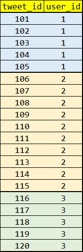
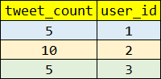
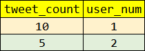
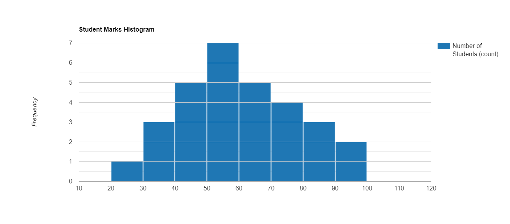

# 📈 Histogram of Tweets


#

# `Q.` 🔗 https://datalemur.com/questions/sql-histogram-tweets

```
This is the same question as problem #6 in the SQL Chapter of Ace the Data Science Interview!

Assume you're given a table Twitter tweet data, write a query to obtain a histogram of tweets posted per user in 2022.
Output the tweet count per user as the bucket and the number of Twitter users who fall into that bucket.

In other words, group the users by the number of tweets they posted in 2022 and count the number of users in each group.
```

### 📋 `tweets Table`

| Column Name | Type      |
| ----------- | --------- |
| tweet_id    | integer   |
| user_id     | integer   |
| msg         | string    |
| tweet_date  | timestamp |

### 📥 `tweets Example Input`

| tweet_id | user_id | msg                                                               | tweet_date          |
| -------: | ------: | ----------------------------------------------------------------- | ------------------- |
|   214252 |     111 | Am considering taking Tesla private at $420. Funding secured.     | 12/30/2021 00:00:00 |
|   739252 |     111 | Despite the constant negative press covfefe                       | 01/01/2022 00:00:00 |
|   846402 |     111 | Following @NickSinghTech on Twitter changed my life!              | 02/14/2022 00:00:00 |
|   241425 |     254 | If the salary is so competitive why won't you tell me what it is? | 03/01/2022 00:00:00 |
|   231574 |     148 | I no longer have a manager. I can't be managed                    | 03/23/2022 00:00:00 |

### 📤 `Example Output`

| tweet_bucket | users_num |
| -----------: | --------: |
|            1 |         2 |
|            2 |         1 |

### 🔗 `check out solution` - [`Solution.sql`](https://github.com/dhaval-rsp/SQL-Learning-Journey/blob/0d9073d9efb57e4aee7f5658e771c61c501781c5/DataLemur/Easy/001_Histogram_of_Tweets/solution.sql)

#

# 🧠 `Thought Process for solution`

Question language is pretty simple - let us break down in steps

1. twitter table is given
2. need to obtain histogram of tweets
3. what type of histogram asked? - tweets posted per user
4. output columns:- `tweet count` | `number of twitter users`

`What is histogram?` **[📊 Understanding Histogram](#-understanding-histogram)** <-- click here to understand basics. \
understanding this part makes you understand the entire question pretty easily.

- since in question it self given that we need to find tweets posted per user, this might seems simple and we would think LIKE
  - user_id 1 posted 5 tweets
  - user_id 2 posted 10 tweets
  - user_id 3 posted 5 tweets
  - user_id 4 posted 10 tweets

* but the question here demands histogram, so instead this simple statistics it is asking for `10 tweets` posted `by` `how many user?` or `5 tweets` by `how many user` this is whast histogram is
  - histogram represent frequency or distribution of quantitative data
  - here our histogram would be number of tweets vs number of user
  - if considering above example there are 2 users who tweeted 10 times || there are 2 users who tweeted 5 times

    | tweet_bucket | users_num |
    | -----------: | --------: |
    |           10 |         2 |
    |            5 |         2 |

#

# 🖼️ `Visual Explanation`

> **New to histograms?** Jump to the **[📊 Understanding Histogram](#-understanding-histogram)** section below before continuing.\

> Tweet table - contains user_id & tweet_id\
> `tweet_id is unique but user_id can be repeate in the table`\
> `if we group by the user_id we will found how many tweet posted by each user`\
> `let suppose user_id `**1 tweeted 5 time**`, user_id `**2 tweeted 10 times**`, user_id `**3 tweeted 5 times**``.

That means we have 2 users who tweeted 5 times and 1 user who tweeted 10 times.

This is what question is asking for, so we need to group by the number of tweets posted by user and count how many users fall into that bucket.\
Didn't get it? Let us see the below example to understand better.

First we need to find how many tweets posted by each user, so we will group by user_id and count the number of tweets posted by each user.



Grouping by any column means we are aggregating the data.[simply squezing the data]\
`Grouped user_id  and count(*) will tell us how many time this user_id present in the table, which is nothing but how many tweets posted by this user.`\

```sql
SELECT
  COUNT(*) AS tweet_count,
  user_id
FROM tweets
WHERE tweet_date >= '2022-01-01' AND tweet_date < '2023-01-01'
GROUP BY user_id;
```

So we will get the below table after grouping by user_id and counting the number of tweets posted



`After this result we need to group by the tweet_count and count how many users are there who tweeted that much.`\

```sql
SELECT
  tweet_count,
  COUNT(*) AS users_num -- number of users
FROM (the result of above query) AS subquery -- this is called subquery
GROUP BY tweet_count; -- grouping by tweet_count column which we got from above query
ORDER BY tweet_count;
```



#

# 🚀 `Alternative Solution`

could be possible but very simple query not need to complexify it

#

# 💡 `Interview Takeaways`

> Histogram\
> Use of proper Group By\
> Understanding of subquery\
> Understanding of aggregation functions like COUNT()\
> Aggregation comes with GROUP BY clause
> Think subqeury as creating new table from existing table to make our data set smaller and easier to work with.

#

# 📊 `Understanding histogram`

> Jump to the **[🖼️ Visual Explanation](#-visual-explanation)**

Test Scores of `30 Students` Imagine these math scores are as below.\
We can group (bins) them into 10 points wide(range of 10 like 31-40) and count the students:

| marks range or bin | marks                | no of students |
| ------------------ | -------------------- | -------------- |
| 21-30              | 25                   | 1              |
| 31-40              | 31,39,39             | 3              |
| 41-50              | 42,45,45,46,49       | 5              |
| 51-60              | 52,53,54,55,56,57,60 | 7              |
| 61-70              | 61,63,65,65,68       | 5              |
| 71-80              | 72,74,76,76          | 4              |
| 81-90              | 82,85,89             | 3              |
| 91-100             | 95,95                | 2              |

Here we created histogram that defines `how many students score` particular range wise marks like `7 students` scored marks between `51-60.`

Question would arise that then why would in case of tweet example we did not created range? \
because data set was small that's why we took particular number of tweets like how many user did 10 tweets how many user did 5 tweets
In case of students marks example the marks range is 0-100.\

So if we are going to count how many student scored 1 marks, 2 marks, 3 marks ... 100 marks then on our graph there would have 100 bars.\
But better approach is take range of marks which makes visualization better.

Number of bars on the graph we called bins, so here we created 8 bins of 10 marks wide.



### 💻 `Question related tags`

- Histogram
- Group By
- Aggregation
- Subquery
