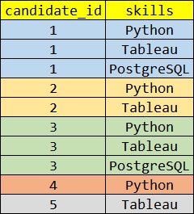
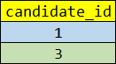

# 📈 Data Science Skills


#

# `Q.` 🔗 https://datalemur.com/questions/matching-skills

```
Given a table of candidates and their skills,
you're tasked with finding the candidates best suited for an open Data Science job.
You want to find candidates who are proficient in Python, Tableau, and PostgreSQL.

Write a query to list the candidates who possess all of the required skills for the job.
Sort the output by candidate ID in ascending order.

Assumption: There are no duplicates in the candidates table.
```

### 📋 `candidates Table`

| Column Name  | Type    |
| ------------ | ------- |
| candidate_id | integer |
| skill        | varchar |

### 📥 `candidates Example Input`

| candidate_id | skill      |
| ------------ | ---------- |
| 123          | Python     |
| 123          | Tableau    |
| 123          | PostgreSQL |
| 234          | R          |
| 234          | PowerBI    |
| 234          | SQL Server |
| 345          | Python     |
| 345          | Tableau    |

### 📤 `Example Output`

| candidate_id |
| ------------ |
| 123          |

### 🔗 `check out solution` - [`Solution.sql`](.\solution.sql)

#

# 🧠 `Thought Process for solution`

Question language is pretty simple - let us break down in steps

1. candidate table contains candidate_id and skill
2. need to find best candidates for job
3. best candidates = having all 3 skills - Python, Tableau, PostgreSQL
4. output column is `candidate_id`

> all 3 skills are in single column, so where with and is not possible
>
> > WHERE clause with AND operator is used to filter rows for multiple conditions, which means on different columns\
> > Here, all 3 condition are in same column, use OR operator or IN operator

#

# 🖼️ `Visual Explanation`

> candidate table - `candidate_id | skill`\
> `WHERE skill in ( 'Python', 'Tableau', 'PostgreSQL' ) - filteration of row with desired skills`\
> `Group BY candidate_id - to get unique candidates`\
> `HAVING count(skill) = 3 - filteration of candidates with all skills`.

```sql
SELECT
  candidate_id, skill
FROM candidates
WHERE skill IN ('Python', 'Tableau', 'PostgreSQL') -- filteration of row with desired skills
```

You will get the below table after filtering the rows with desired skills\
Note that where in condition made sure that ppl with other skills like Java got filtered out\
Still the answer is incomplete because they want people having all 3 skills\
For which we will count number of skills = 3 that's how we filtered elgible people



```sql
SELECT
  candidate_id
FROM candidates
WHERE skill IN ('Python', 'Tableau', 'PostgreSQL') -- filteration of row with desired skills
GROUP BY candidate_id -- to get unique candidates
HAVING count(skill) = 3 -- filteration of candidates with all skills

/*
Just FYI - skill column removed because we are grouping by candidate_id
Which means aggregation happening on table and skill column is not part of aggregation.
*/
```



`So we got candidate_id 1 and 3 because they had all 3 skills - Python, Tableau, PostgreSQL\`

#

# 🚀 `Alternative Solution`

could be possible but very simple query not need to complexify it

#

# 💡 `Interview Takeaways`

> Use of proper Group By\
> Understanding of aggregation, why skill is not part of the SELECT clause\
> Aggregation comes with GROUP BY clause
> Where + AND happens on different columns, not same column\
> Where + OR happens on same column\
> Where + IN happens on same column\
> Having clause is used to filter aggregated data\

#

### 💻 `Question related tags`

- Group By
- Aggregation
- WHERE + IN
- Having
